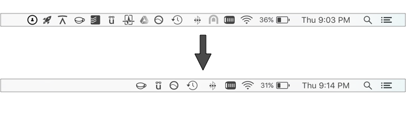

# CleanMenuBar

# Information:

- Tested on 10.12
- SIMBL plugin to hide menu bar icons for selected third-party apps on macOS
- Author:
    + [Kevin Beaulieu](https://github.com/kevinmbeaulieu)

# Installation:

1. Download [mySIMBL](https://github.com/w0lfschild/app_updates/raw/master/mySIMBL/mySIMBL_0.2.5.zip)
2. Clone this repo
3. Edit `appsToHide` list in `CleanMenuBar/CleanMenuBar.m` to include bundle identifiers of apps you'd like to hide from menu bar.
4. Build Xcode project (will add CleanMenuBar to mySIMBL automatically)
5. Logout & log back into macOS
